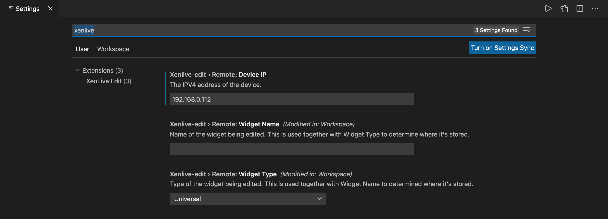

**中文版请见底部**
# XenLive Edit

This is the companion VSCode extension to the tweak `XenLive`.

# Features

Live reloading of XenHTML widget on your iOS device as you edit!

XenLive syncs the changes to your device when you save the file.

**To avoid always manually saving, definitely checkout vscode's `files.autoSave`! For instant hot-reloading, set `files.autoSave` to `afterDelay` and `files.autoSaveDelay` to `1`ms!**

# Requirements

* Only XenHTML v2 and above are supported.
* Install the `XenLive` tweak from [My Repo](https://zerui18.github.io/zx02/) on your iOS device to start editing!

# Extension Settings

To find the settings for this extension, open VSCode's settings page and search for `xenlive`, you can then choose to edit them in `User` or `Workspace` scope. Read more about VSCode settings from the [official documentation](https://code.visualstudio.com/docs/getstarted/settings).

<i>xenlive-edit Settings</i>

 
The following 4 settings are required for XenLive-Edit:

**The following 1 setting is recommended to be set at `User` level, which is shared among all workspaces.**
* `xenlive-edit.remote.deviceIP`: The IPv4 address through which this computer can access your phone.

**The following 2 settings should only be set at `Workspace` level, as they should be unique for each workspace.**
* `xenlive-edit.remote.widgetName`: The name of the widget being edited.
* `xenlive-edit.remote.widgetType`: The type of the widget being edited.

# Take Note

XenLive needs to be enabled via the `XenLive Edit: Enable` command everytime a workspace is opened, otherwise nothing would happen.

For a short demo please view [this video](https://www.youtube.com/watch?v=6BxoA_d3xUc).

# Known Issues

TBD

Please report issues at XenLive's [Bug Tracker Repo](https://github.com/Zerui18/XenLive-Issues-Tracker).

# Release Notes

Version | Notes
--- | ---
*1.0.0* | First release!
*1.0.1* | Bug fixes.
*1.1.0-beta1* | Remake, switched from rsync to use custom system.

  

# 中文指示

这款插件需配合iOS设备上的`XenLive`插件使用。

# 功能

编辑XenHTML Widget时在关联的iOS设备上即时重载。

XenLive会在启用的文件夹内任意文件保存时与iOS端进行同步。

**要实现即时同步，请在Code设置中为当前工作区启用 `Auto Save` 。设 `files.autoSave` 为 `afterDelay` 、设 `files.autoSaveDelay` 为 `1`ms。**

# 需求

* 仅支持 XenHTML 版本2及更高
* iOS设备需装有[我的Cydia源](https://zerui18.github.io/zx02/)中的 `XenLive` 插件。

# 插件设置

在VSCode设置页面中搜索 `xenlive` 以显示本插件的3个设置项。每个设置项均可在 `用户` 或 `工作区` 等级设置。`用户` 等级设置会应用于所有工作区，而个别 `工作区` 可以覆盖 `用户` 等级的设置。详情可见[官方文档](https://code.visualstudio.com/docs/getstarted/settings)。

<i>xenlive-edit 设置页面</i>

 
使用前请完成以下3项设置：

**推荐在`用户`等级设置以下1条，从而对所有工作区生效**
* `xenlive-edit.remote.deviceIP`: iOS设备的IPv4地址。

**仅在`工作区`等级设置以下2条。**
* `xenlive-edit.remote.widgetName`: 此工作区编辑的Widget的名称。
* `xenlive-edit.remote.widgetType`: 此工作区编辑的Widget的类别。

# 注意

每打开工作区时需重新执行 `XenLive Edit: Enable` 以开启同步。

使用流程请见[短视频](https://www.bilibili.com/video/BV1Sh411Q7NS)。

# 已知问题

暂无

请在 XenLive 专属的 [Bug Tracker Repo](https://github.com/Zerui18/XenLive-Issues-Tracker) 报告.

# 版本日志

版本 | 记录
--- | ---
*1.0.0* | 第一版发布
*1.0.1* | 优化
*1.1.0-beta1* | 重制，从rsync转至自制系统